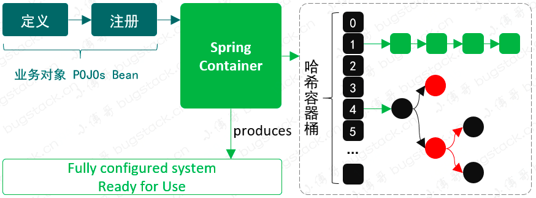

# mini-spring
手写简化版spring

## 第一章、实现一个简单的 bean 容器

简单的 Spring Bean 容器实现，需要 Bean 的定义、注册、获取三个基本步骤，简化设计如下:

- 定义：在 BeanDefinition 类中，定义一个Object类型的bean，用于存放bean的实例
- 注册：在 BeanFactory 类中，定义一个Map<String, BeanDefinition>类型的 map 容器，用于存放bean的定义
- 获取：在 BeanFactory 类中，定义一个getBean(String name)方法，用于获取bean实例