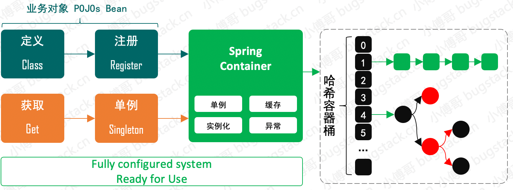

# mini-spring
手写简化版spring

## 第一章、实现一个简单的 bean 容器

简单的 Spring Bean 容器实现，需要 Bean 的定义、注册、获取三个基本步骤，简化设计如下:


- 定义：在 BeanDefinition 类中，定义一个Object类型的bean，用于存放bean的实例
- 注册：在 BeanFactory 类中，定义一个Map<String, BeanDefinition>类型的 map 容器，用于存放bean的定义
- 获取：在 BeanFactory 类中，定义一个getBean(String name)方法，用于获取bean实例

### 工程结构
```css
main
  ├── java
  │   └── org
  │       └── springframework
  │           └── beans
  │               └── factory
  │                   ├── BeanFactory.java
  │                   └── config
  │                       └── BeanDefinition.java
  └── resources
```

### 核心合代码示例
```java
public void testBeanFactory() {

     // 1.定义 BeanDefinition
     BeanDefinition beanDefinition = new BeanDefinition( new UserServiceImpl());
     
     // 2.定义 BeanFactory
     BeanFactory beanFactory = new BeanFactory();
     
     // 3.注册 BeanDefinition
     beanFactory.registerBeanDefinition("userService", beanDefinition);
     
     // 4.获取 Bean
     UserService userService = (UserService) beanFactory.getBean("userService");
     
     // 5.执行 Bean 方法
     List<User> users = userService.listUser();
     
     Assert.assertNotNull(users);
 }
```


## 第二章、实现bean的定义，注册，获取



### 工程结构
```css

main
├── java
│   └── org
│       └── springframework
│           └── beans
│               └── factory
│                   ├── BeanFactory.java
│                   ├── config
│                   │   ├── BeanDefinition.java
│                   │   └── SingletonBeanRegistry.java
│                   └── support
│                       ├── AbstractAutowireCapableBeanFactory.java
│                       ├── AbstractBeanFactory.java
│                       ├── BeanDefinitionRegistry.java
│                       ├── DefaultListableBeanFactory.java
│                       └── DefaultSingletonBeanRegistry.java
└── resources

```
### 核心合代码示例
```java
public void test() {
    // 1.定义 BeanDefinition
    BeanDefinition beanDefinition = new BeanDefinition(UserServiceImpl.class);
    
    // 2.定义 BeanFactory
    DefaultListableBeanFactory beanFactory = new DefaultListableBeanFactory();
    
    // 3.注册 BeanDefinition
    beanFactory.registerBeanDefinition("userService", beanDefinition);
    
    // 4.获取 Bean
    UserService userService = (UserService) beanFactory.getBean("userService");
    Assert.assertNotNull(userService);
    
    // 5.执行 Bean 方法
    List<User> users = userService.listUser();
    Assert.assertNotNull(users);
}
```
